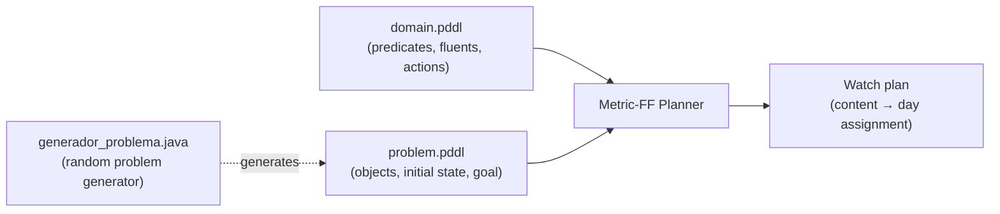

# Redflix Planner — Automated Movie & TV Watch-List Scheduling with PDDL


An automated **AI planning system** that builds an optimal weekly watch schedule for a
"Redflix" streaming user, given the movies/episodes they want to see, the narrative
order they must be watched in, and the free time they have available. Modeled from
scratch as a classical planning domain and solved with the **Metric-FF** planner, then
incrementally extended across four iterations to support multiple prerequisites,
simultaneous ("must-watch-together") content, per-day content caps, and per-day time
budgets in minutes.

## Why this exists

Streaming catalogs are full of shared universes and crossover episodes (Marvel, DC,
Sherlock, Star Wars…) where content can only be enjoyed in a specific order, or must be
watched close together to make narrative sense. Manually figuring out "what do I watch,
and on which day" quickly turns into a constraint-satisfaction problem — which is
exactly what classical AI planning is built for. This project models that problem as a
PDDL domain and lets an off-the-shelf planner solve it.

## How it works



Each level defines two PDDL actions:

- **`requerimiento(contenido)`** — pulls a piece of content into the "must be
  scheduled" set, either because the user explicitly wants to watch it or because it's
  a prerequisite (or parallel companion) of something that must be watched.
- **`agendar(contenido, dia)`** — assigns a piece of content to a specific day, only
  once all of its prerequisites are satisfied and the day's capacity constraint
  (content count or minutes) isn't exceeded.

The goal state simply requires that every piece of content the user *wants* to see ends
up scheduled on some day.

## Iterations

The domain was built incrementally, adding one real-world constraint per iteration:

| Level | Adds | Key mechanic |
|---|---|---|
| **`nivel_basico/`** | Baseline scheduling | Content has at most one predecessor; ≤1 item/day |
| **`extension1/`** | Chains of prerequisites | Content can have **N predecessors** (e.g. watching all of *Sherlock* season 1 before the movie) |
| **`extension2/`** | Simultaneous content | New `paralelo` predicate — crossover episodes must be scheduled the same day or on adjacent days |
| **`extension3/`** | Daily content cap | Hard limit of **3 items per day**, enforced directly in the `agendar` action |
| **`extension4/`** | Time-budget scheduling | Content cap replaced by a **200-minutes-per-day** budget using PDDL fluents and each item's `duracion` |

Each folder is self-contained and includes:

- `domain.pddl` — the planning domain for that iteration
- `problem.pddl` — a hand-crafted example problem (with a documented, human-readable solution)
- `generador_problema.java` — a random problem generator used to stress-test the domain
- `random_problem*.pddl` + `output-*.txt` — generated problems and their solved plans

## Example

`nivel_basico/problem.pddl` asks the planner to schedule *Capitana Marvel*,
*Super Mario Bros* and *El Señor de los Anillos: Anillos de Poder*, where the first and
third titles each require watching a predecessor movie first. Metric-FF resolves the
prerequisite chain automatically and produces a 5-day plan:

| Mon | Tue | Wed | Thu | Fri |
|---|---|---|---|---|
| Capitán América: El Primer Vengador | El Señor de los Anillos: La Guerra de los Rohirrim | Capitana Marvel | Super Mario Bros | El Señor de los Anillos: Anillos de Poder |

By `extension4/`, the same idea scales to a realistic case with parallel crossover
episodes and a 200-minute nightly budget, e.g. packing *Star Wars: Episode IV* (121 min)
with a *Breaking Bad* episode (54 min) into a 175-minute Friday, while keeping every
predecessor and parallel-content constraint satisfied.

## Running it

Each level is solved independently with a PDDL planner that supports `:typing`,
`:adl` and `:fluents` (this project used [Metric-FF](https://fai.cs.uni-saarland.de/hoffmann/metric-ff.html)):

```bash
./ff -o nivel_basico/domain.pddl -f nivel_basico/problem.pddl
```

To generate a new random test problem for a given level:

```bash
cd extension4
javac generador_problema.java
java generador_problema
```

## Context

Built for the *Inteligencia Artificial* course (Grado en Ingeniería Informática, FIB —
Universitat Politècnica de Catalunya), 2024–2025 Q1, as a team project practicing
domain-independent classical planning: knowledge representation in PDDL, incremental
domain design, and validation through both hand-crafted and randomly generated test
cases.
